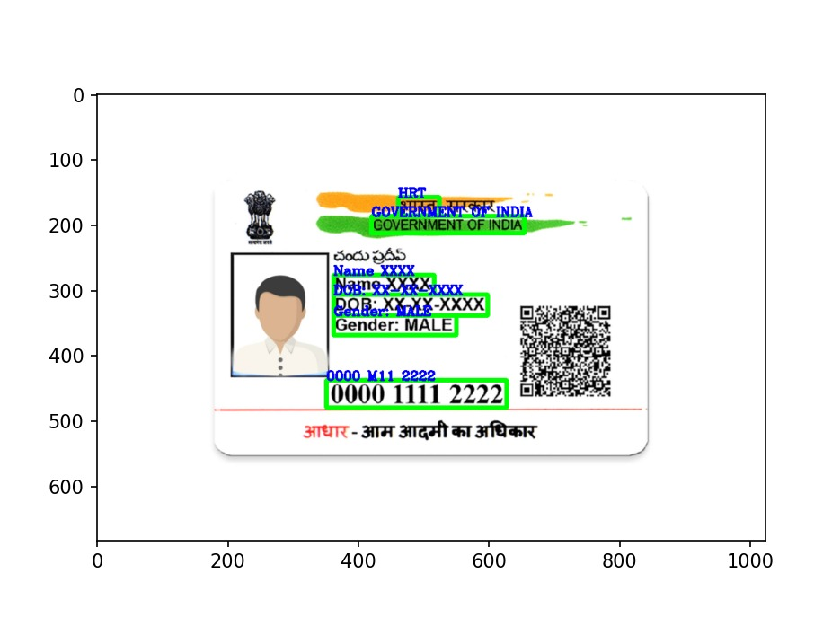

# Optical Character Recognition
---

### OCR Image-to-Excel Converter" is a Python script leveraging the easyocr library to perform Optical Character Recognition (OCR) on images. It detects and extracts English text from images, subsequently saving the recognized text into an Excel file. Ideal for digitizing textual content from various sources such as documents, forms, and more.

---

